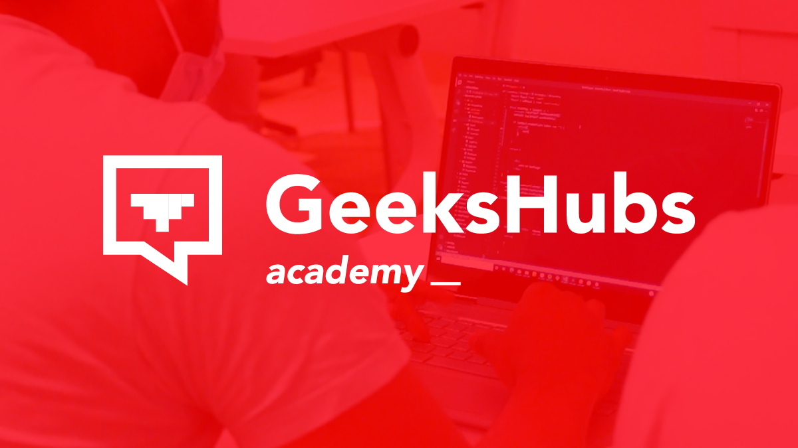

---

#  Mastermind
 🧠[Mastermind](https://martaguillemolmos.github.io/mastermind/) 🧠

 ---

**Tercer proyecto del Bootcamp Full Stack Developer en GeekHubs**

En este proyecto nos solicitan emular el juego del Mastermind con el stack JS, CSS3 y HTML5. Antes de empezar con el proyecto, primero debemos saber en qué consiste este juego.

## Contenidos

-  [Tecnologías utilizadas](#tecnologias-utilizadas)
-  [Inicio](#inicio)
-  [Instrucciones](#instrucciones)
-  [Pantalla usuario](#pantalla-usuario)
-  [Mastermind](#mastermind)
-  [Pantalla ganador](#pantalla-ganador)
-  [Pantalla perdedor](#pantalla-perdedor)
-  [Media Query](#media-query)
-  [Mejoras](#mejoras)
-  [GitHub Pages](#github-pages-link)

## Tecnologias utilizadas:
Las tecnologías que hemos utilizado para desarrollar el proyecto son las siguientes:

    
     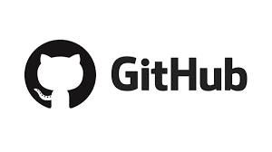 

Por otro lado, la plantaforma que hemos utilizado para diseñar todo el contenido gráfico de la página es:

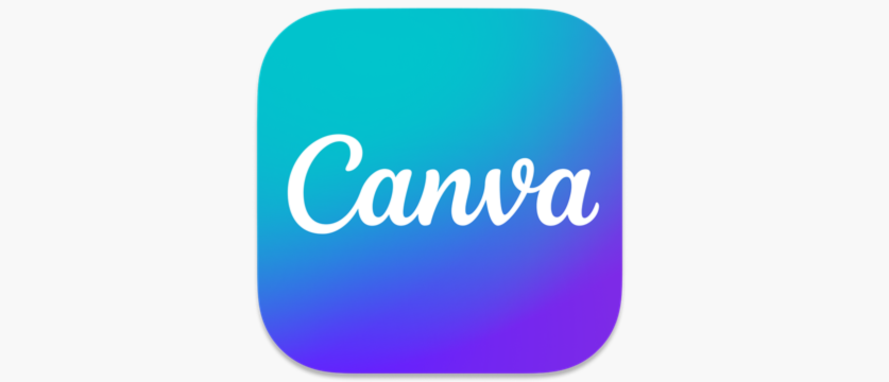

---
## Inicio:
En el diseño de la pantalla de inicio, contiene las opciones de cambiar a las pantallas que contienen las instrucciones del juego o por el contrario, al juego.

    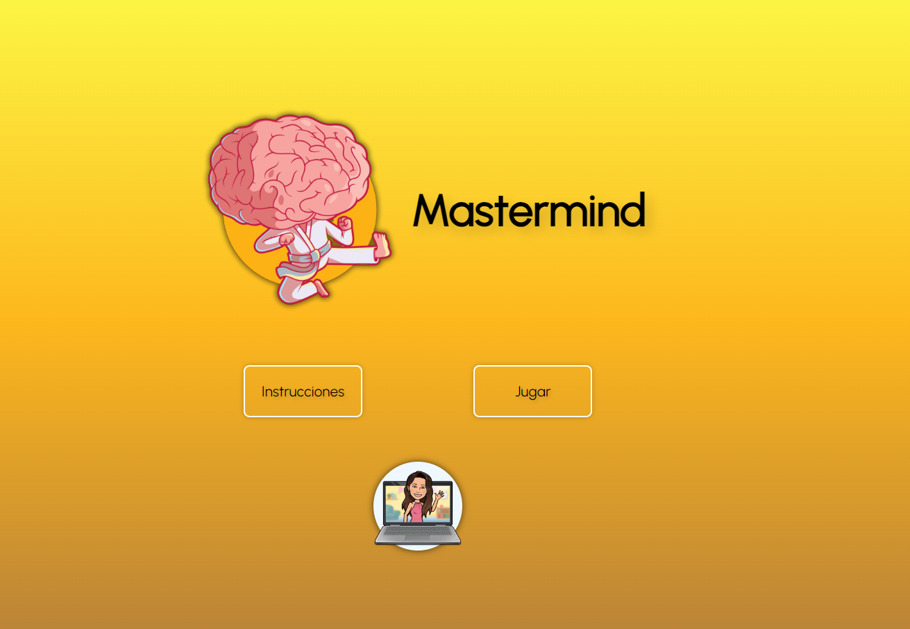

---
## Instrucciones
Al hacer click en "Instrucciones", nos dirige a la siguiente pantalla, donde obtenemos información a acerca de cómo debemos navegar en las pantallas y, las reglas del Mastermind.

    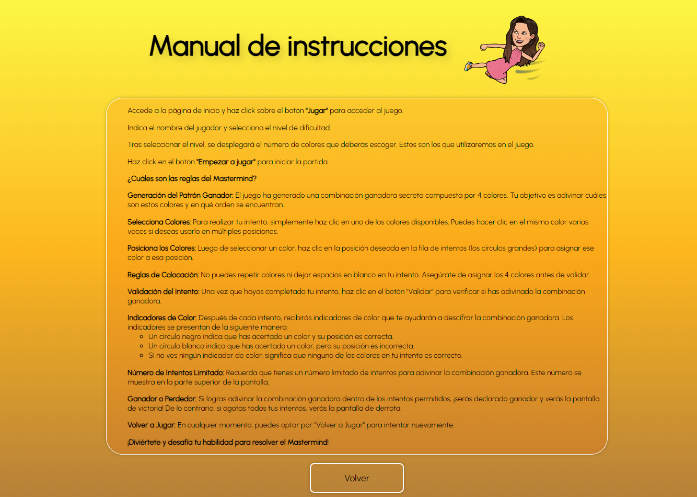

---
## Pantalla usuario
Antes de iniciar el juego, se le solicitará al usuario que introduzca el nombre y seleccione el nivel de dificultad. 
Al seleccionar el nivel de dificultad, se desplegará una serie de contenedores vacíos que deberá colorear. Y, estos serán los colores que utilizaremos en el juego.

    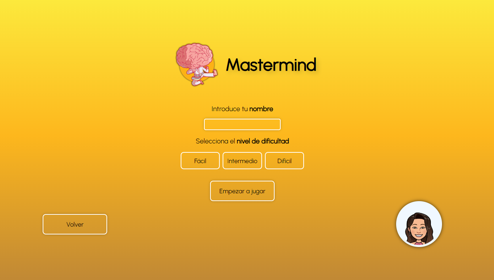
     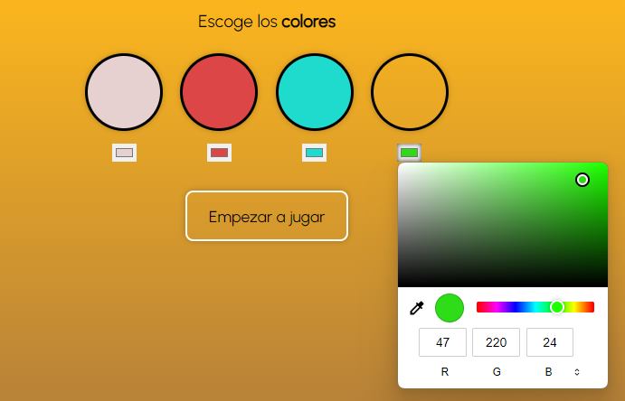

Para poder pasar de pantalla, se deberá rellenar todos los campos.
En caso que el usuario no quiera continuar jugando, podrá volver a la pantalla de inicio al pulsar en "Volver".

---
## Mastermind
¡Empieza el juego! En esta pantalla aparece en la parte superior, el número de intentos que tenemos que va variando en función de los intentos que tenemos disponibles en cada momento.
En la parte central, se encuentran los colores que hemos recuperado de la pantalla anterior y, el tablero vacío. Aquí el usuario deberá seleccionar la combinación de colores ganadora y, para poder comprobar si coincide con la combinación de Mastermind, deberá pulsar sobre el botón verificar.

    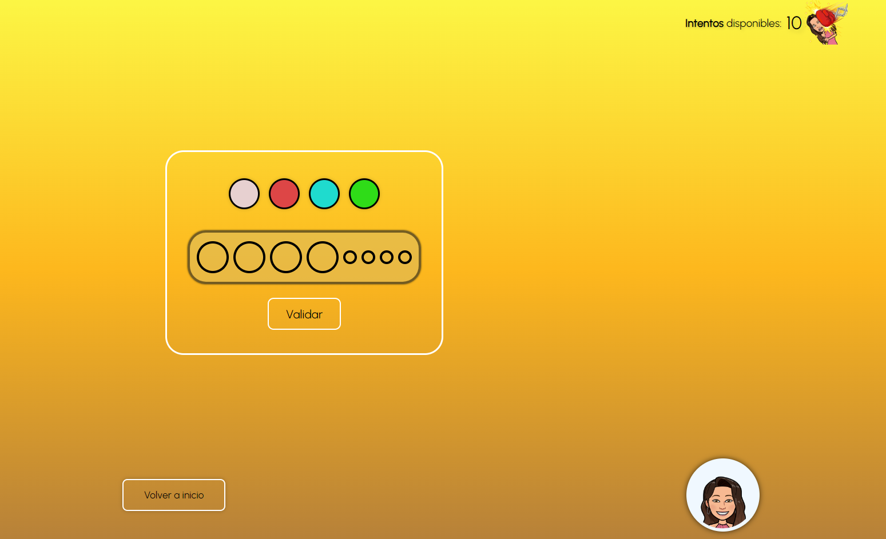

En el caso que no hayamos acertado la combinación ganadora, en la parte izquierda de la pantalla aparecerá la combinación que hemos realizado.

   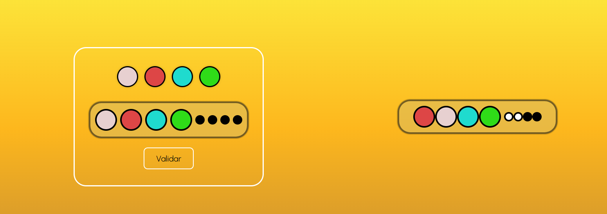

Por otro lado, en caso que nuestro patrón sea identico a la combinación que ha generado Mastermind, aparecerá la pantalla de ganador o bien, si ya hemos gastado todos los intentos disponibles, a la pantalla de perdedor.
Si, durante la partida el usuario hace click sobre "Volver a inicio" se borrará todo el contenido almacenado en LocalStorage.

---
## Pantalla ganador
En caso que hayamos acertado la combinación ganadora, aparecerá en pantalla el nombre que haya indicado el usuario junto con el texto ¡has ganado!

   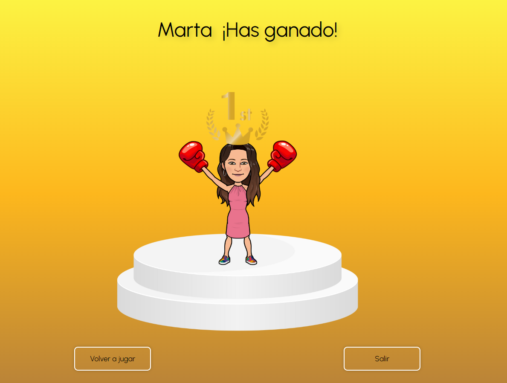

Si el usuario hace click en "volver a jugar", volverá a la pantalla de Mastermind sin tener que pasar de nuevo por la pantalla usuario. Se rescatará tanto el nombre de usuario como los colores seleccionados para jugar la partida.
Por el contrario, si pulsa en "Salir" se borrará el contenido almacenado en LocalStorage y volverá a la pantalla de inicio.

---
## Pantalla perdedor
En caso que no hayamos acertado la combinación ganadora, aparecerá en pantalla el nombre que haya indicado el usuario junto con el texto ¡has perdido!

   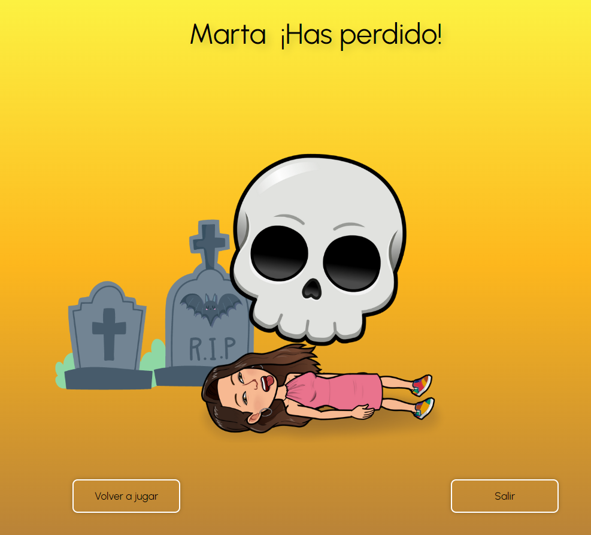

Si el usuario hace click en "volver a jugar", volverá a la pantalla de Mastermind sin tener que pasar de nuevo por la pantalla usuario. Se rescatará tanto el nombre de usuario como los colores seleccionados para jugar la partida.
Por el contrario, si pulsa en "Salir" se borrará el contenido almacenado en LocalStorage y volverá a la pantalla de inicio.

---
## Media Query
Este proyecto utiliza consultas de medios para garantizar que la página web se vea y funcione correctamente en diferentes tamaños de pantalla.

Además de estos ajustes de tamaño de fuente, tenga en cuenta que CSS también controla el desbordamiento horizontal oculto (overflow-x: oculto) y el desbordamiento vertical automático (overflow-y: auto).

Este es el resultado desde un dispositivo móvil.

   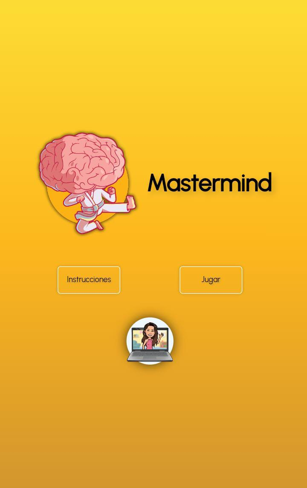

---
## Mejoras
Las mejoras que se podrían realizar al proyecto son las siguientes:
1- En HTML: El uso de botones en vez de la utilización de div.
2- Mejora en la nomenclatura del contenido, dependiendo de las propiedades de cada uno de ellos.
3- GitHub: El uso de prefijos previos a la redacción del commit.

---
## GitHub Pages
https://martaguillemolmos.github.io/mastermind/