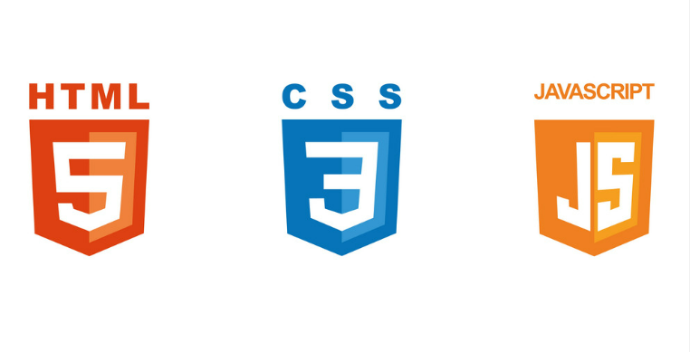

---

#  Mastermind
 🧠[Mastermind](https://martaguillemolmos.github.io/mastermind/) 🧠

 ---

**Tercer proyecto del Bootcamp Full Stack Developer en GeekHubs**

En este proyecto nos solicitan emular el juego del Mastermind con el stack JS, CSS3 y HTML5. Antes de empezar con el proyecto, primero debemos saber en qué consiste este juego.

## Contenidos

-  [Tecnologías utilizadas](#tecnologias-utilizadas)
-  [Inicio](#inicio)
-  [Instrucciones](#rules)
-  [Pantalla jugador](#start)
-  [Tablero Mastermind](#select-your-colours)
-  [Pantalla ganador](#game-board)
-  [Pantalla perdedor](#game-over)
-  [Media Query](#media-query)
-  [Mejoras](#improvements-i-would-have-liked-to-integrate)
-  [Contribuciones](#contributions)
-  [Contacto](#contact)
-  [GitHub Pages](#github-pages-link)

## Tecnologias utilizadas:
Las tecnologías que hemos utilizado para desarrollar el proyecto son las siguientes:

    
      

Por otro lado, la plantaforma que hemos utilizado para diseñar todo el contenido gráfico de la página es:

---

